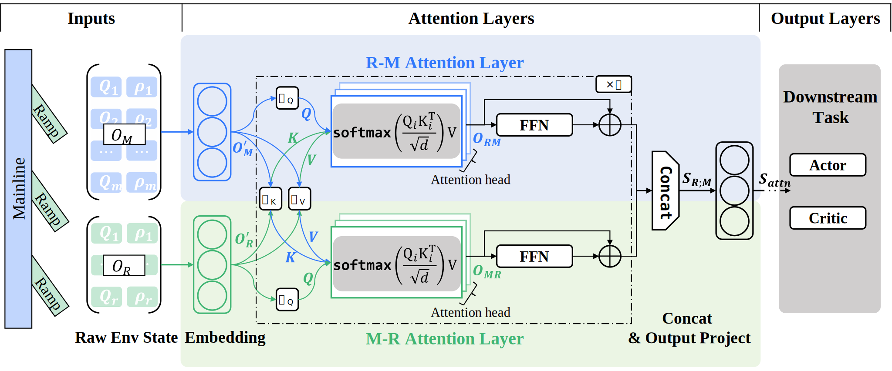

# Coordinated Ramp Metering Strategy Based on Deep Reinforcement Learning Incorporating Attention Mechanism

This project presents a coordinated ramp metering strategy based on reinforcement learning. It incorporates attention mechanisms to model spatial-temporal interactions between mainline segments and on-ramps, and applies Proximal Policy Optimization (PPO) for policy learning. The simulation scenario is based on a real world freeway corridor with four on-ramps and four off-ramps.

## Model Description

The model is composed of two main components:

- Env: The environment component, responsible for simulating the traffic flow and providing the state information to the agent.
- RL: The reinforcement learning component, implementing the PPO algorithm and using attention mechanisms to model the spatial-temporal interactions between mainline segments and on-ramps.

## Model Architecture



## File Structure

```ruby
AttentionRampMetering/
│
├──main.py
│
├─ Env/
│  ├──multiRampEnv.py             # the environment class
│  ├──detectorGroup.py
│  ├──parseDetectors.py
│  ├──quickStart.py
│  ├──sumoStart.py
│  ├──trafficElement.py
│  └─ MultiRamp/
│      ├──detectorPos.CSV
│      ├──denseDetectors.add.xml  # detectors configuration
│      ├──flow.rou.xml            # traffic flow configuration
│      ├──flow.vtype.xml          # vehicle type configuration
│      ├──multiRamp.net.xml       # network configuration
│      └──multiRamp.sumocfg       # simulation configuration
│
└─ RL/
    ├──attention.py               # attention layers and mlp layers
    ├──ppo_continuous.py          # PPO algorithm implementation
    ├──buffer.py
    ├──normalize.py
    └──wrappers.py
```

## Getting Started

1. Clone the repository:

    ```bash
    git clone https://github.com/YSXXXXXXX/MacroTrafficFlowModel.git
    ```

2. Install dependencies:

    ```bash
    pip install -r requirements.txt
    ```

3. Run the simulation:

    ```bash
    python main.py
    ```

## Citation

If you use this code in your research, please cite the following paper:

```bibtex
@article{yu2025coordinated,
  title={},
  author={},
}
```

## License

This project is licensed under the MIT License.
